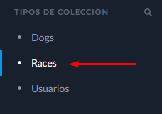
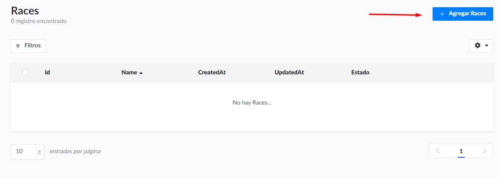
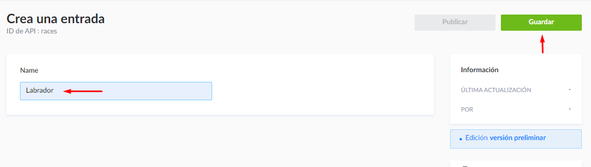

# Prueba Técnica SouthernMinds - Back-End

La prueba consiste en hacer un formulario de alta de mascotas. Para cada mascota que se de de alta se deberá registrar su nombre, raza, sexo y edad.

## Información
Este repositorio corresponde al back-end de la aplicación.
Repositorio del front-end de la aplicación: [https://github.com/LeanAHG/pruebaTecnicaFront](https://github.com/LeanAHG/pruebaTecnicaFront)

## Instalación
Para el uso de esta aplicación es necesario tener previamente instalado [MongoDB](https://www.mongodb.com/)

- Clonar repositorio: 
```bash
git clone https://github.com/LeanAHG/pruebaTecnicaBack.git
```
- En una terminal usa este comando para instalar todas las dependencias:
```bash
npm install
```
## Uso

### MongoCompass
Conectarse al puerto local y proceder con el paso 3

### Consola de comandos
- 1- En una consola de comandos inicializar mongoDB con el comando:
 ```cmd
mongod
```
- 2- Y en otra consola de comandos realizar la conexión al puerto con: 
 ```cmd
mongosh
```
- 3- Finalmente en una terminal usar este comando para inicializar la aplicación:
```bash
npm run develop
```
## Agregar razas desde Strapi
<div>
 <hr/>
    <br/>
     - Regístrate en Strapi para acceder al panel de administrador y una vez registrado ingresar a la coleción de razas. 
    <br/>
    <br/>
    <div>
      
    </div>
    <br/>
      - Clickear en agregar.
    <br/>
    <br/>
    <div>
      
    </div>
    <br/>
      - Insertar en el campo name el nombre que desee ingresar y finalmente clickear en guardar.
    <br/>
    <br/>
    <div>
      
    </div>
    <br/>
</div>
    
## Rutas activas
- ### GET razas
http://localhost:1337/races

- ### POST una nueva mascota
http://localhost:1337/dogs

## Tecnologías
- #### MongoDB
<p align = "left"> <a href="https://www.mongodb.com/" target="_blank" rel="noreferrer">  </ a > </p>


- #### Strapi.io
<p align = "left"> <a href="https://strapi.io/" target="_blank" rel="noreferrer">  </ a > </p>
